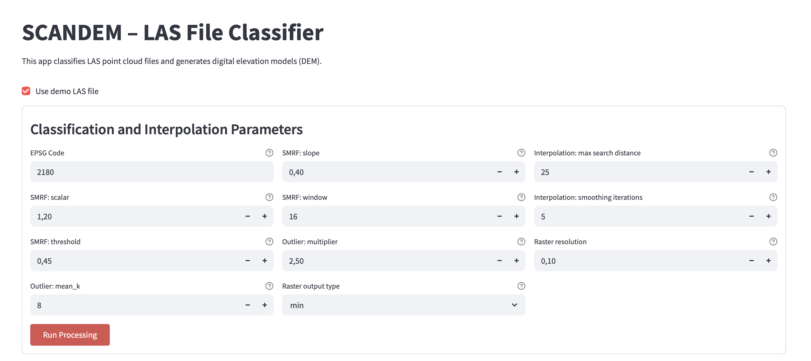

# SCANDEM – LAS File Classifier

**SCANDEM** (Streamlit Classification and DEM generation) is an interactive application built with Python and Streamlit that allows you to classify `.las` point cloud files, generate digital elevation models (DEM), interpolate missing values, and explore the results visually and statistically.

## Features

- Support for `.las` point cloud files.
- Ground classification using the SMRF (Simple Morphological Filter).
- Outlier removal using statistical method.
- DEM raster generation from classified ground points.
- Interpolation of missing values in the DEM.
- Visual inspection of DEMs and histograms of elevation.
- Side-by-side comparison of raster statistics.
- Highlighting interpolated pixels.
- Demo mode with example LAS file for quick testing.

## Interface Preview



## Folder Structure
```text
scandem/ 
├── input/ # Folder for input LAS files (e.g., demo.las) 
├── output/ # Automatically generated output files 
├── app.py # Main Streamlit application 
├── config.json # Configuration generated at runtime 
├── main.py # Main script to use from console
├── requirements.txt # Python dependencies 
└── README.md # This file
```

## Requirements

The application requires Python 3.9+ and the following packages:

- `streamlit`
- `pdal`
- `gdal` (from osgeo)
- `rasterio`
- `matplotlib`
- `numpy`

## Installation

It's recommended to use Conda:

```bash
conda create -n scandem-env python=3.10
conda activate scandem-env
conda install -c conda-forge pdal gdal rasterio matplotlib streamlit
pip install numpy
```

Or install via env.yml if provided:
```bash
conda env create -f env.yml
conda activate scandem-env
```

## Running the App

Navigate to the project folder and run: `streamlit run app.py`
The app will launch in your browser at `http://localhost:8501`.


## Demo Mode

If a file named demo.las exists in the input/ folder, the app will offer an automatic demo mode, ideal for testing or public showcasing. You can include a sample file as input/demo.las.

## Project Status

This application is under active development. Upcoming features may include:

Export to GeoTIFF / GeoJSON
Batch processing of multiple files

## Author
Developed by Paweł Terefenko, Kamran Tanwari, Jakub Śledziowski, Andrzej Giza, Xiaohao Shi as part of Baltic Coastal Monitoring Team.

## Licence
Distributed under the MIT License.


